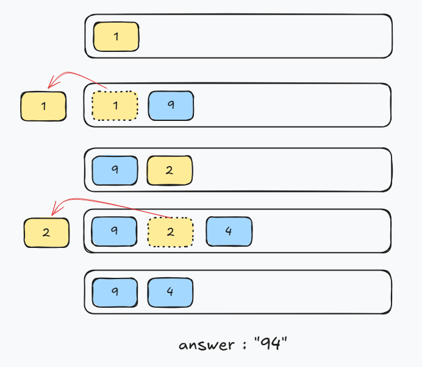

### 문제 이름 : 큰 수 만들기

* **문제 사이트** : https://school.programmers.co.kr/learn/courses/30/lessons/42883
* **Level** : 2
* **알고리즘 유형** : Greedy
* **시간복잡도** : O(n)
* **참고 링크** :

---

### 풀이

1. 숫자를 왼쪽부터 순회하면서 Deque에 저장
2. 현재 숫자가 Deque의 마지막 숫자보다 크면 마지막 숫자를 제거
3. 제거 횟수가 `k`에 도달할 때까지 반복
4. 순회가 끝난 후에도 제거 횟수가 부족하면 뒤에서부터 제거
5. Deque의 숫자를 순서대로 이어 붙여 결과 생성

**예시 설명 사진**


---

### 핵심 코드

<details>
<summary>핵심 코드 보기</summary>

```java
// 뺀 횟수
int cnt = 0;

for (char ch : number.toCharArray()) {
    
    // dq 마지막 값과 ch값 비교하여 뒤 부터 큰 값 넣기
    while (!dq.isEmpty() && dq.peekLast() < ch && cnt < k) {
        cnt++;
        dq.pollLast();
    }
    
    dq.offerLast(ch);
}
```

* **문제 접근 방식** : Deque를 이용해 현재 숫자와 이전 숫자를 비교
* **핵심 아이디어** : 현재 숫자가 더 크면 앞의 작은 숫자를 제거
* 앞에서부터 큰 숫자를 남겨야 최종 숫자가 커짐

</details>

### 후기
